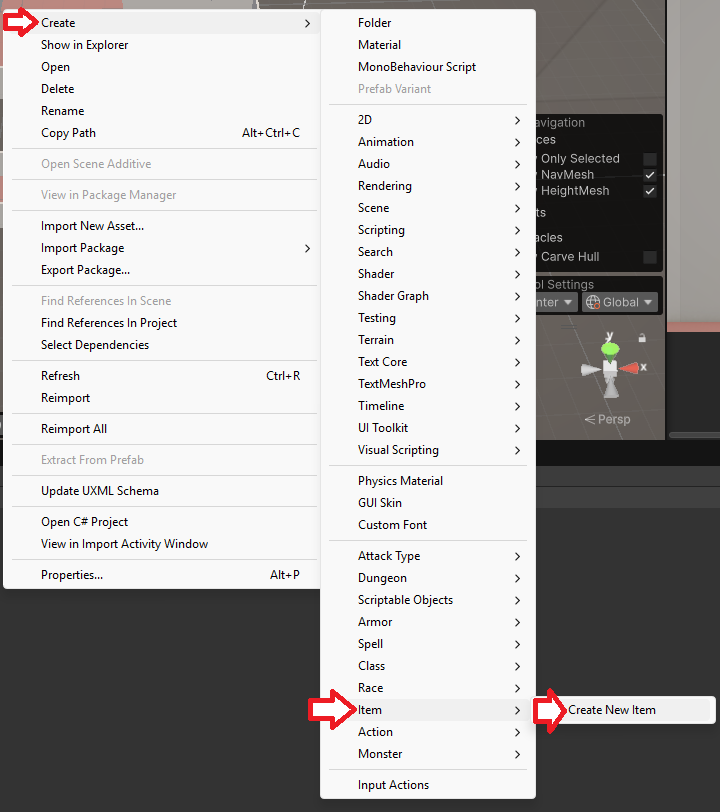
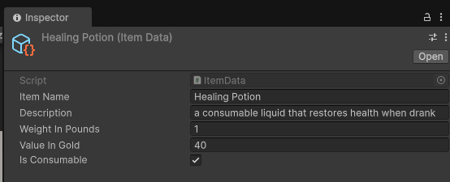
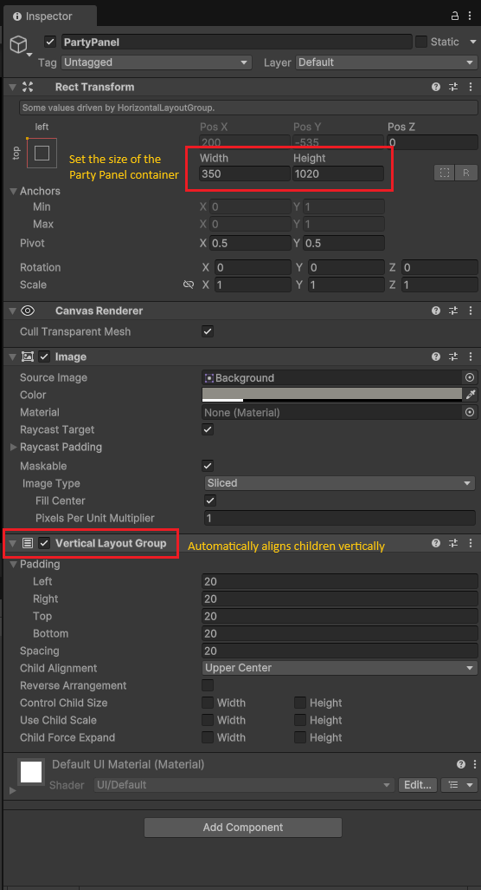
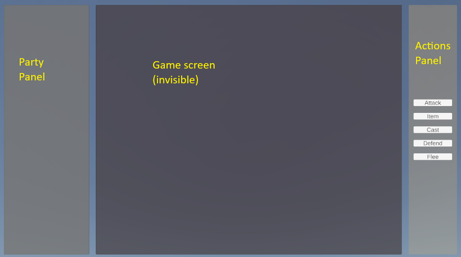
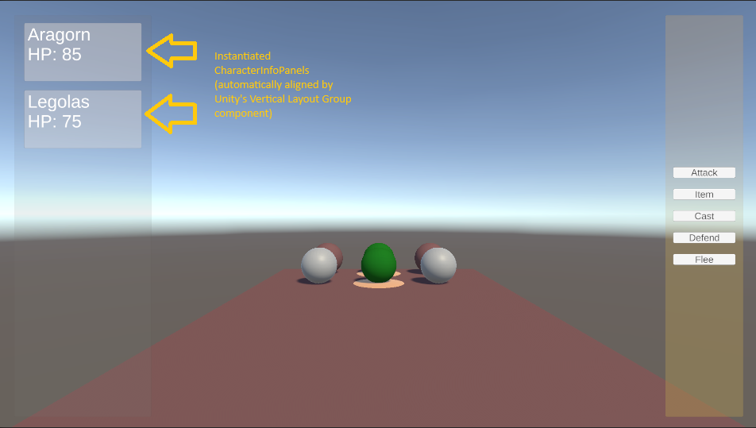

# Unity Grid-based RPG Prototype

## Overview

This is a Unity project that demonstrates a turn-based and grid-based RPG prototype (based on old-school RPGs like
[the Wizardry series](https://wizardry.wiki.gg/wiki/Wizardry_%28franchise%29) or [Might and Magic 1 & 2](https://en.wikipedia.org/wiki/Might_and_Magic_Book_One:_The_Secret_of_the_Inner_Sanctum)).
The project includes a simple grid movement control system, character movement, and basic combat mechanics which will be used as the groundwork for a more complex RPG game.

## Features
- **Grid Movement**: Move characters on a grid-based map using a gamepad or WASD keys.
- **Character Management**: Add and remove characters from the party.
- **UI Integration**: Display character information (name and HP) in the UI using TextMeshPro.
- **Dynamic UI**: Use layout groups to dynamically arrange character panels in the UI.
- **ScriptableObjects**: Utilize ScriptableObjects to improve performance and clarity for data that is more static in nature (e.g. classes, races, items, etc).
- **Event System**: Use Unity's event system to communicate between different components in the project.

## Getting Started

### Prerequisites
- Unity 2020.3 or later
- TextMeshPro package

### Installation
1. Clone the repository:
2. Open the project in Unity.

### Usage

**Running the Project**:
 - Press Play in the Unity Editor to see the game in action.
 - You will be able to walk around a small map and experience thrilling random encounters every 5 steps.
 - Encounters load a separate Encounter area with randomly spawned monsters.
 - Attacking the enemies just selects the first one and deals 100 damage (instant kill).

## Project Structure

This is the basic structure of the project to give you an idea of how the project is organized.

```
+---Resources
|   |
|   +---Data
|   |   |
|   |   +---AttackTypes
|   |   |       Bite.asset
|   |   |       Claw.asset
|   |   |       ...
|   |   |
|   |   +---Characters
|   |   |       Biff.asset
|   |   |       Fred.asset
|   |   |       ...
|   |   |
|   |   +---Classes
|   |   |       Fighter.asset
|   |   |       ...
|   |   |
|   |   +---Dungeons
|   |   |       Dungeon01.asset
|   |   |       ...
|   |   |
|   |   +---Encounters
|   |   |       Encounter01.asset
|   |   |       ...
|   |   |
|   |   +---Monsters
|   |   |       Centipede.asset
|   |   |       Millipede.asset
|   |   |       ...
|   |   |
|   |   +---Parties
|   |   |       ExampleParty.asset
|   |   |       ...
|   |   |
|   |   \---Races
|   |           Dwarf.asset
|   |           Human.asset
|   |           ...
|   |
|   +---Materials
|   |       CharacterSkin.mat
|   |       GoblinSkin.mat
|   |       ...
|   |
|   \---Prefabs
|           Block.prefab
|           Block_Corner.prefab
|           ...
|
+---Scenes
|       Dungeon01.unity
|       Encounter.unity
|       ...
|
+---Scripts
    |
    +---Components
    |       Character.cs
    |       Monster.cs
    |       ...
    |
    +---Constants
    |       LayerMaskConstants.cs
    |       ...
    |
    +---DataTemplates
    |       ActionTypes.cs
    |       ArmorData.cs
    |       ...
    |
    +---EventHandling
    |       EncounterEventNotifier.cs
    |       GeneralNotifier.cs
    |       ...
    |
    +---Managers
    |       EncounterManager.cs
    |       GameManager.cs
    |       ...
    |
    +---Movement
    |       TurnBasedPlayerInputHandler.cs
    |       ...
    |
    \---UI
            EncounterCharacterInfo.cs
            ...
```

### Project Organization

This project follows the standard Unity directory structure and adheres to best practices where possible. Below are key areas of the project structure.

#### DataTemplates Directory

This directory contains "Templates" for Unity's [ScriptableObjects](https://docs.unity3d.com/6000.0/Documentation/Manual/class-ScriptableObject.html). ScriptableObjects are used instead of POCOs to improve efficiency, project organization, and ease of creation.

I have created sensible classes in this directory for objects that will remain relatively static, such as item data, classes, etc. If you can create something that won't change (such as a healing potion or sword), it probably fits as a ScriptableObject. The Unity editor provides a convenient way to create such items through attributes on the class, which translates into a menu selection.

For example, the `ItemData` class looks like this:

```csharp
using UnityEngine;

[CreateAssetMenu(fileName = "NewItem", menuName = "Item/Create New Item")]
public class ItemData : ScriptableObject
{
    public string itemName;
    public string description;
    public int weightInPounds;
    public int valueInGold;
    public bool isConsumable;
}
```



Selecting this menu item opens a form for creating an item



## Scripts

### Managers

#### Game Manager

At a high level, this  is a singleton object which tracks persistent data and handles communication between other game components
in order to keep things modular and simple. This class removes the need for components to have a direct reference to other 
components and allows them to use an event-driven approach to their actions.


Since this is a global singleton object, any object can access its data by referencing the Game Manager's `Instance` field without
the need for setting it directly as one of their fields, for example you might see something like:

```csharp
GameManager.Instance.AddCharacterToParty(new Character("Biff"));
```

This class also handles game-wide things like loading and swapping scenes and pausing.

#### Encounter Manager

This manager handles keeping track of when encounters should happen as well as generating and managing them. It gets events from
other components that tell it whether the player has moved or how much noise they made and it uses that data to determine
when encounters should occur.

#### Party Manager

Manages the party of characters, including adding and removing characters, and instantiating UI resources based on the state
of the party.

### Events

We try to use events as much as makes sense for a smooth and flexible gaming experience. Events allow us to decouple components
and have things react to each other in a natural way.

We use "notifier" classes to implement an observer pattern in order for components to detect when certain things happen. For example,
we have a Player Action Notififier class which lets other components know when the player moved and how loud they were when they
moved

```csharp
public class PlayerActionNotifier : MonoBehaviour
{
    public static event Action OnPlayerMoved;
    public static event Action<int> OnPlayerMadeNoise; // noise made at specific noise-level

    /// <summary>
    /// Notify listeners that the player has moved
    /// </summary>
    public static void PlayerMoved()
    {
        OnPlayerMoved?.Invoke();
    }

    /// <summary>
    /// Notify listeners that the player made noise and at what level
    /// </summary>
    /// <param name="noiseLevel">An arbitrary noise level to indicate how loud the noise was</param>
    public static void PlayerMadeNoise(int noiseLevel)
    {
        OnPlayerMadeNoise?.Invoke(noiseLevel);
    }
}
```

The Encounter Manager class cares about this since it controls when encounters occur, so it subscribes to both `OnPlayerMoved` and 
`OnPlayerMadeNoise` in order to decide the liklihood of an encounter.

### Player Input Handling

You can find the code for player movement in the `Assets/Movement/TurnBasedPlayerInputHandler.cs` script.

#### Enforcing grid movement

Since we are enforcing grid-based movement, we need to modify the default Unity control scheme - which moves in a continuous fashion.

To do this, we need to:

1. Only allow movement along an axis
2. Each movement needs to be a set distance
3. The movement should be smooth and a set duration
4. Correct for inaccuracies by snapping to the nearest grid position on each move

## User Interface

We use Unity's built-in UI system to handle displaying things like character information panels and action menus
on the battle screen. The basic process is to create a canvas which will contain Unity panels in a desired layout
and then add Unity UI components (such as the Vertical Layout Group component) which automatically align the child
objects. The process is reminescent of developing web pages with CSS.



After customizing the Party Panel, middle encounter view, and Actions Panel, the result looked like this:



and at runtime, when the character info panels are added as children to the Party Panel and the middle area is set
to invisible, it looks like this:


## License
This project is licensed under the MIT License. See the [LICENSE](LICENSE) file for details.

## Acknowledgements
- [Unity](https://unity.com/)
- [TextMeshPro](https://assetstore.unity.com/packages/essentials/beta-projects/textmesh-pro-84126)

